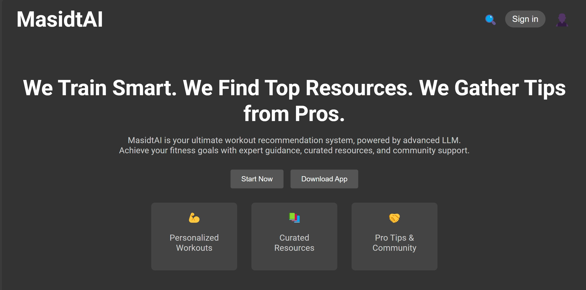
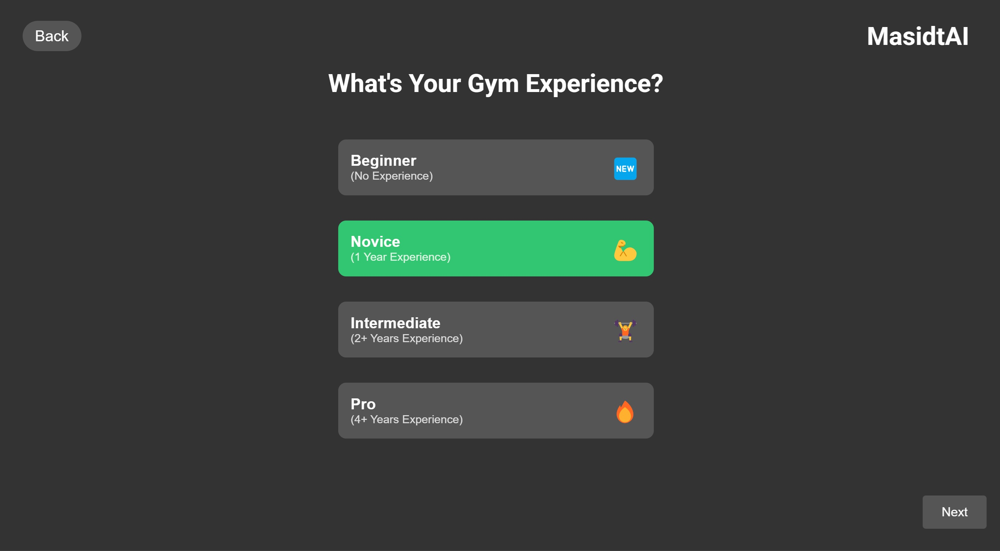
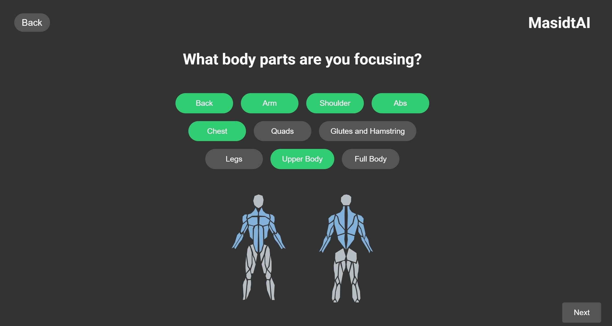
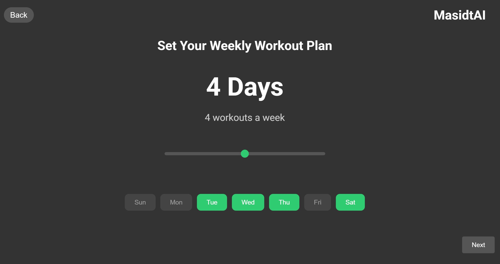
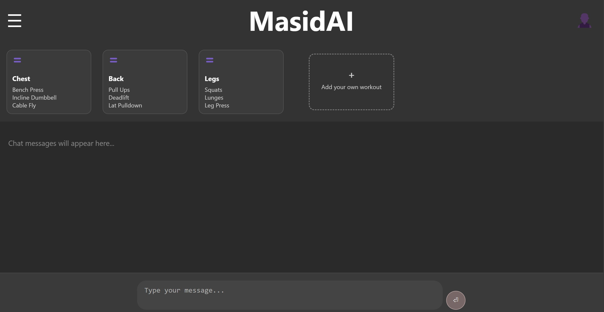
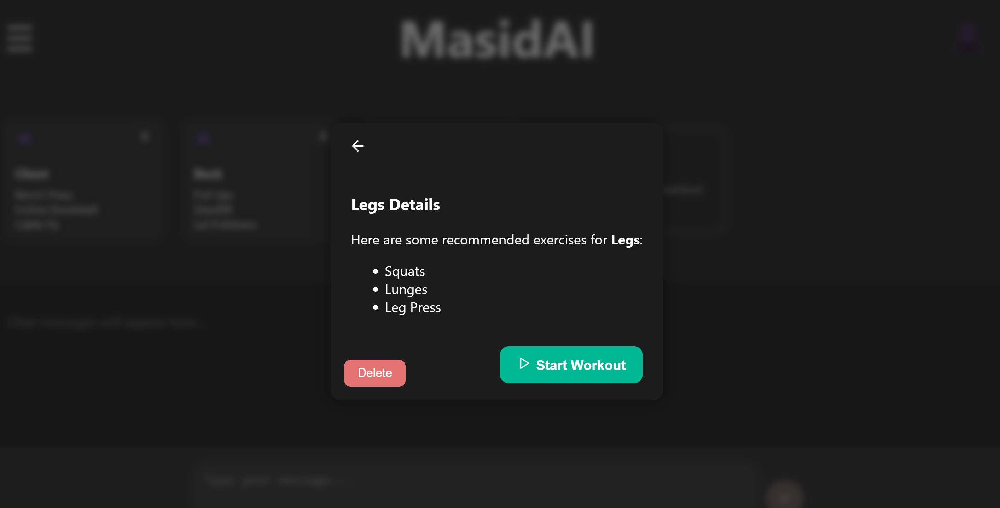
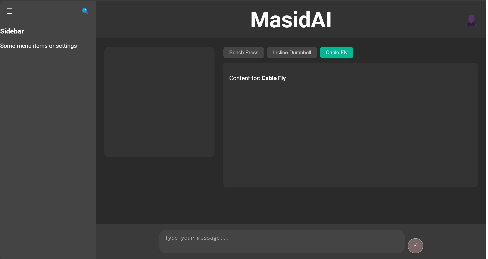

# 🧠 MasidAI — Your Smart Workout Companion

MasidAI is an intelligent fitness assistant that delivers personalized workout routines and chat-based coaching powered by machine learning and large language models. Built with a sleek modern UI and a modular backend, it combines smart design and smart logic.

---

## 🌐 Live Demo (Coming Soon)

🎥 Sneak peeks of the UI will be shared below with screenshots.

---

## 🛠️ Tech Stack

### ⚙️ Frontend
- **React.js** — Fast, modular, and scalable UI
- **CSS** — Custom modern styling with responsiveness
- **React Router DOM** — Dynamic routing across pages
- **DNDKit** — Drag-and-drop interface for custom workouts

### 🧠 Backend (Planned)
- **FastAPI** — High-performance Python API
- **LangChain** — Custom workout logic powered by LLMs
- **PostgreSQL** — Relational database for user data
- **Graph Database (optional)** — Behavior-linked recommendation graph

---

## 🎨 UI Pages

### 🚀 Welcome Page
> A landing experience introducing MasidAI, with CTA buttons and a modern banner layout.

### 📋 Survey Pages
> Multi-step animated sliding survey to capture:
- Demographics
- Equipment access
- Workout goals
- Focus Muscle groups
- Experience level
- Weekly Plan
- Exercise preferences
- Health Issue

### 💬 Main Chat Page
> Interactive chat assistant with:
- ChatGPT-style expanding input box
- Muscle group scrollable pane
- Drag-and-drop exercise containers
- Responsive sidebar with search

### 🏋️ Workout Page
> Clean workout flow UI with:
- Sidebar and header navigation
- Split pane layout (Square Area + Tabbed Pane)
- Tabbed exercises based on selected target
- Integrated chat area

---

## 💡 Features (In Progress)

- [x] Modern, mobile-responsive UI
- [x] Scrollable, reorderable muscle groups
- [x] Dynamic survey navigation
- [ ] LLM-based workout recommendations
- [ ] Chat assistant with personalized advice
- [ ] PostgreSQL + Graph DB backend
- [ ] Authentication and user history
- [ ] Deployment with Docker & CI/CD

---

## 📸 Screenshots
### Welcome Page

### Survey Pages

### Main Chat Page Demo

### Workout Start Page Demo

---

## 🧬 Data & AI

MasidAI plans to leverage:
- 🌐 **LLMs + Langchain** for natural, contextual advice
- 🧠 **User graph behaviors** for smart recommendations
- 📊 **PostgreSQL schemas** for long-term personalization

---

## 🧾 License

This project is licensed under the MIT License.  
Feel free to fork, clone, and contribute 💪

---

## 🤝 Contributions Welcome

If you're passionate about fitness, AI, or UI/UX — feel free to open a PR, file an issue, or just drop a ⭐.

---

## 📬 Contact

Made with ❤️ by [Owen JungHo Park]  
📧 [jungho.career@gmail.com]  

---
